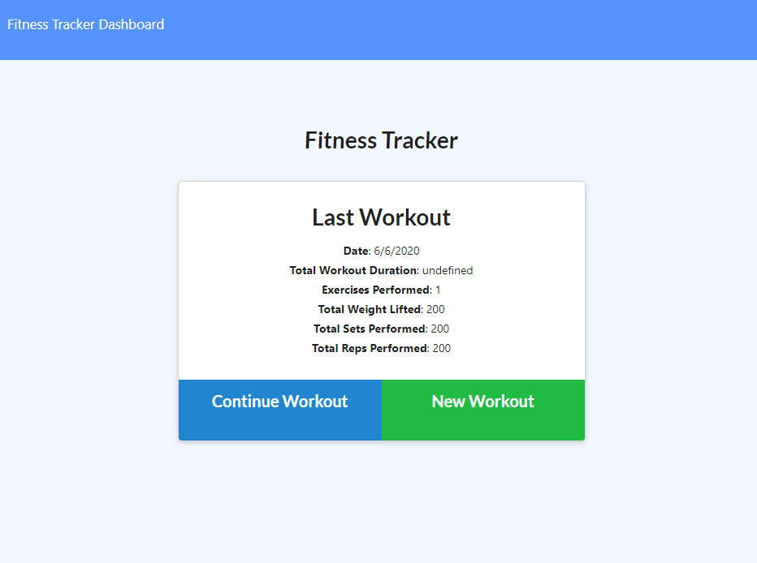
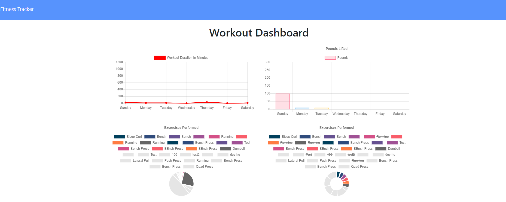
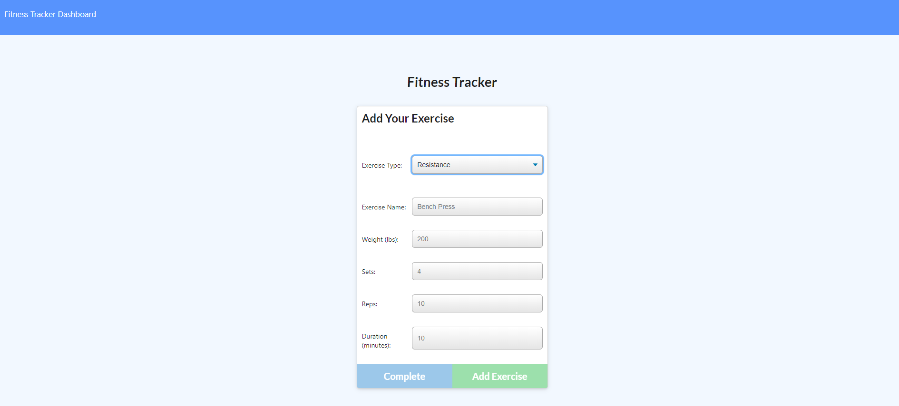

# workout-tracker

## Description

This is an application that allows a user to track their fitness activities. It combines the ability to track, update and add an exercise. It also has a statistic page where users can correctly sumarise the activity they've completed in the past 7 days.

The technologies used to create this application include:

- Javascipt
- Node.js
- Express.js
- MongoDB
- Mongoose.js
- heroku

## Deployment

This application has been deployed across Heroku, you can view this here: https://git.heroku.com/secure-plains-32563.git

## Application Preview

Preview of the application below:

Statistics page below:

Fitness tracker page below:

